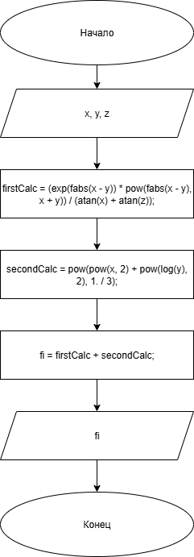

# Домашнее задание к работе 5

## Условие задачи
Создать программу вычисления указанной величины. Результат проверить при заданных исходных значениях.


## 1. Алгоритм и блок-схема

### Алгоритм
1. **Начало**
2. Инициализировать переменные:
   - `x`, `y`, `z` (float) - исходные данные;
   - `firstCalc`, `secondCalc` (float) - промежуточные действия;
   - `fi` (float) - результат вычислений.
3. Произвести вычисления:
   - `firstCalc` = (exp(fabs(x - y)) * pow(fabs(x - y), x + y)) / (atan(x) + atan(z)) - вычисление первого выражения;
   - `secondCalc` = pow(pow(x, 2) + pow(log(y), 2), 1. / 3) - вычисление второго выражения;
   - `fi` = firstCalc + secondCalc - финальный результат.
4. Вывести результат расчетов, указав в текстовом виде.
5. **Конец**

### Блок-схема
 

[https://github.com/glebofrl/lab4hwVSU/blob/master/scheme.png](https://github.com/glebofrl/lab5VSU/blob/master/scheme.png)

## 2. Реализация программы

```
#include <stdio.h>
#include <locale.h>
#include <math.h>
#define _USE_MATH_DEFINES
#define _CRT_SECURE_NO_DEPRECATE

void main()
{
	setlocale(LC_CTYPE, "RUS");
	float x, y, z, fi;
	float firstCalc, secondCalc;
	x = -2.235 * pow(10, -2);
	y = 2.23;
	z = 15.221;
	firstCalc = (exp(fabs(x - y)) * pow(fabs(x - y), x + y)) / (atan(x) + atan(z));
	secondCalc = pow(pow(x, 2) + pow(log(y), 2), 1. / 3);
	fi = firstCalc + secondCalc;
	printf("Результат вычислений: %.3f\n", fi);

	system("pause");

}
```

## 3. Результаты работы программы


## 4. Информация о разработчике

Глебов Илья, бИПТ-252
